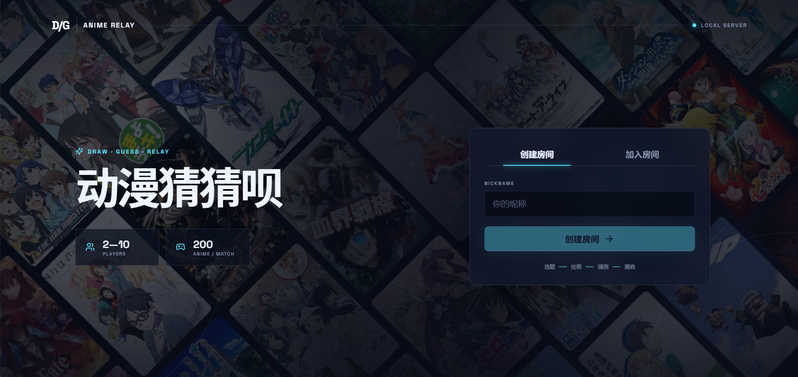
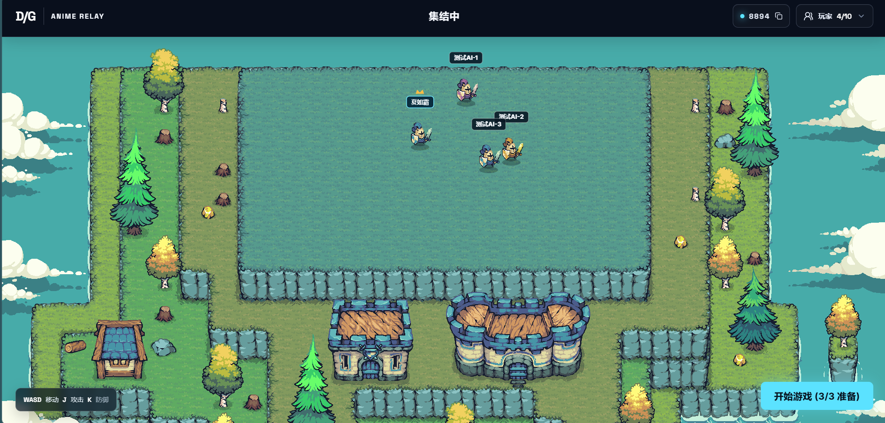
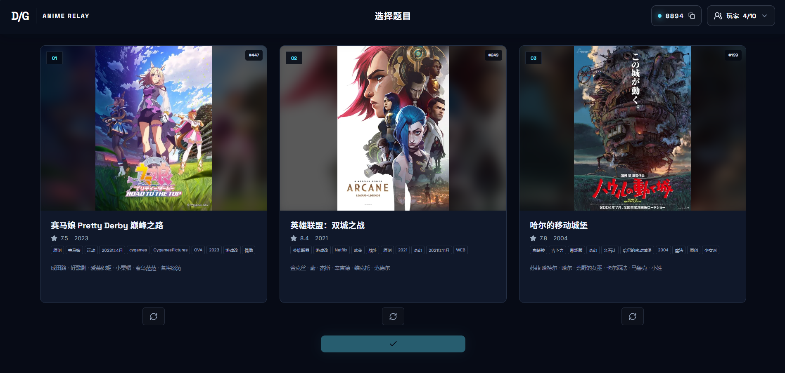
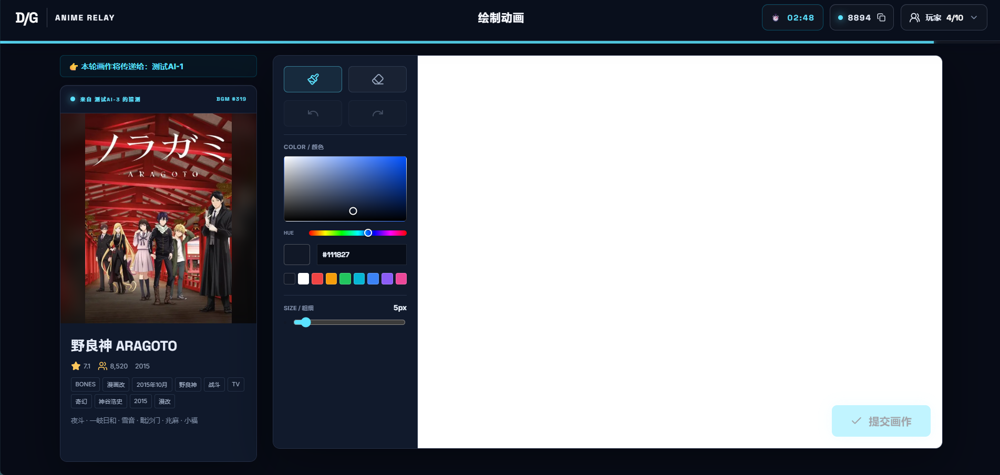
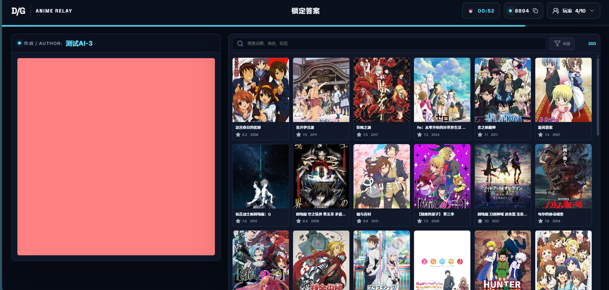
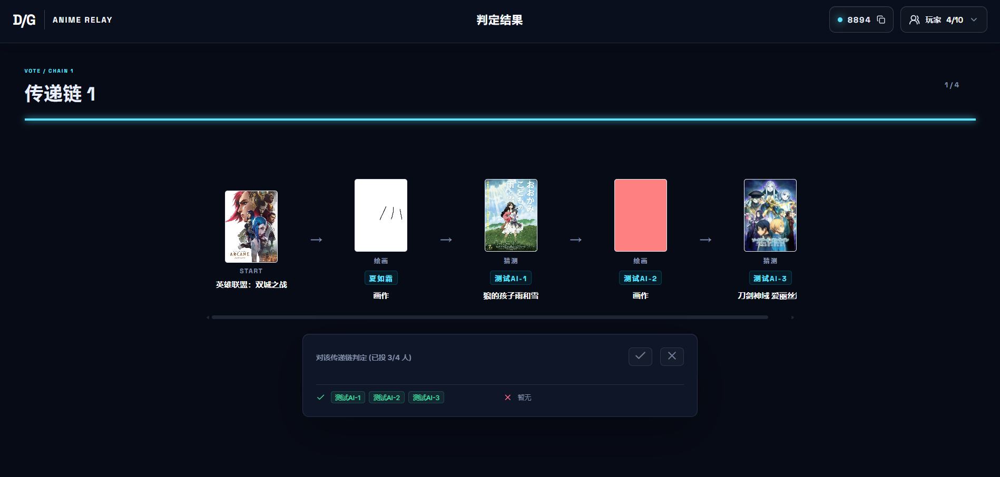
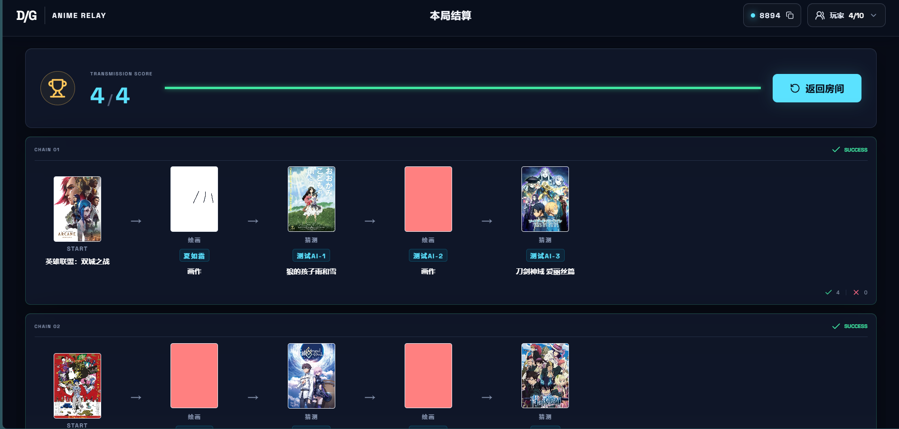
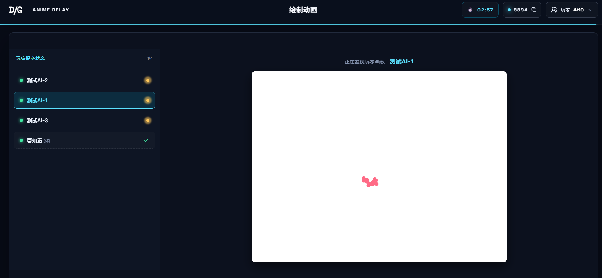
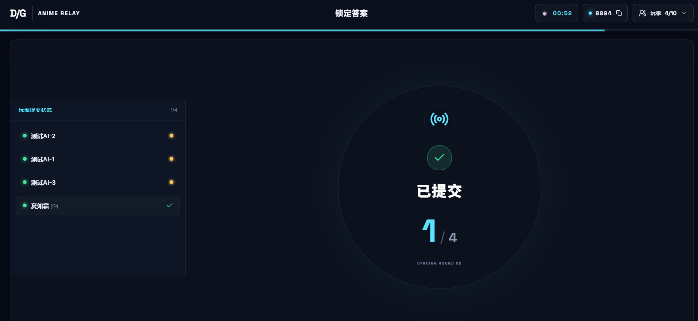

# 动画版你画我猜

一款面向 2–10 人的本地实时 Web 派对游戏。每位玩家使用独立浏览器加入同一房间，围绕动画题库完成“选题 → 绘画 → 猜测 → 再绘画”的接力，最后逐链揭晓、投票并结算。

## 快速开始

环境要求：Node.js 20+、npm 10+。首次运行：

```bash
npm install
npm run dev
```

- 前端：http://localhost:5173
- 服务端：http://localhost:3001
- 健康检查：http://localhost:3001/health

也可以分别运行：

```bash
npm run dev:client
npm run dev:server
```

## 游戏方式

1. 一名玩家创建房间并设置 2–10 个席位，其他玩家输入房间码加入。
2. 房主可在玩家抽屉中拖动换位或一键打乱。最终席位 `1 → N` 就是本局传递链顺序。
3. 所有人准备后，房主开始游戏；每局从 719 部本地动画中随机锁定 200 部候选。
4. 每人从 3 个题目中选择 1 个，然后进行绘画；下一位只能看到上一步结果。
5. 猜测阶段不输入自由文本，而是从本局 200 部动画中搜索并选择答案。
6. 所有接力完成后，客户端逐链播放绘画过程并进行成功/失败投票，最后展示得分和完整链路。

传递规则：第 `r` 轮中，席位索引为 `p` 的玩家处理链 `(p - r + N) % N`。偶数人数进行 `N` 轮，每条链经过所有玩家；奇数人数进行 `N - 1` 轮，每条链有 `N - 1` 次贡献。

## 大厅操作

- `W A S D`：移动，速度为每帧 2 像素。
- `J`：朝当前方向攻击并击退近距离玩家。
- `K`：防御；正面防住攻击时会把攻击者反弹。

普通击退和反弹击退都使用 480ms 的逐帧插值。击退期间观察端忽略被击玩家约每 50ms 回传的位置包，避免位移呈现为分段瞬移。

## 页面展示

### 01 首页

约 `-45°` 的双向动漫封面瀑布流位于标题和入房表单背后。



### 02 房间大厅

Tiled 海岛地图、实时玩家、准备状态、席位调整和开始游戏。



### 03 选择动画

每名玩家从三张动画资料卡中选择本链起始题目。



### 04 绘画

左侧显示题目资料，右侧为 800×600 画布和常驻调色工具。



### 05 确定动画 / 猜测

查看上一位玩家的画作，从 200 个本局候选中搜索并锁定答案。



### 06 结算展示 / 揭晓投票

逐步展示传递链，绘画按笔画回放，随后全员判定成功或失败。



### 07 结算界面

展示总分、各链结果和房主“再来一局”入口。



### 08 等待界面（实时看他人画板）

提前提交绘画后，可查看仍在作画玩家的实时笔画；目标动画会被隐藏。



### 09 一般等待界面

提交当前任务后等待其他玩家同步进入下一阶段。



## AI 测试玩家

项目内置轻量 Socket.IO 测试机器人，会自动加入、准备并完成各阶段任务：

```bash
node apps/client/bot.js <房间码> [昵称]
```

示例：

```bash
node apps/client/bot.js 8894 测试AI-1
```

机器人仅用于本地流程测试。服务端热更新或重启会清空内存房间，需要重新建房并重新启动机器人。

## 开发与验证

```bash
npm run typecheck
npm test
npm run build
npm run preview
```

数据同步：

```bash
npm run sync:anime
npm run sync:lobby-map
```

- `sync:anime` 默认从 `E:\codex_project\hextech-bisyllable-duel\data\anime` 生成本地题库和 WebP 封面。
- `sync:lobby-map` 默认从 `E:\codex_project\tinyswordsproject\maps\island_02.tmx` 生成运行时地图 JSON 和静态地形 PNG。

## 项目结构

```text
drawandguess/
├─ apps/client/                 React 19 + TypeScript + Vite
│  ├─ public/anime/             动画目录和封面
│  ├─ public/maps/              Tiled 运行时地图
│  ├─ public/tiny-swords/       大厅像素素材
│  └─ src/                      页面、组件、状态和样式
├─ apps/server/                 Express 5 + Socket.IO 服务
│  ├─ src/roomStore.ts          权威房间状态与游戏状态机
│  └─ test/roomStore.test.ts    房间流程和席位顺序测试
├─ packages/game-core/          共享类型、常量和环形调度规则
├─ scripts/                     题库与地图同步脚本
├─ docs/screenshots/            页面截图
├─ AGENT.md                     Codex 接手说明
└─ DEVELOPMENT_TARGETS.md       产品与状态设计参考
```

## 当前限制

- 房间只保存在服务端内存中，服务端重启或热更新后无法恢复。
- 身份保存在当前标签页的 `sessionStorage`；刷新可恢复，换标签页不会共享。
- 绘画以 PNG Data URL 存储，单张限制约 2.5MB，不适合大规模公网部署。
- 当前布局以桌面端为主，最小可用宽度约 1180px，未做触屏专项适配。
- 暂无账户、匹配、聊天、持久化、排行榜和房间密码。

## 素材说明

海岛大厅使用用户提供的 [Pixel Frog — Tiny Swords Free Pack](https://pixelfrog-assets.itch.io/tiny-swords)。动画封面来自本地题库，仅随项目用于开发和演示；正式分发前应自行确认对应素材授权。
